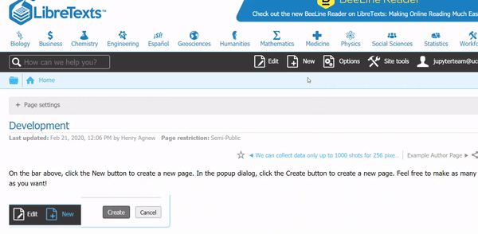
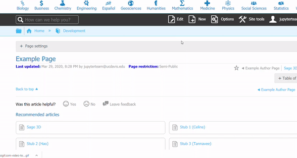
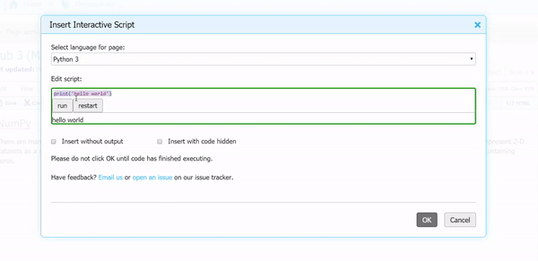
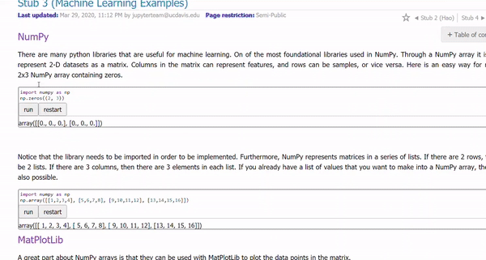

# CKeditor Binder Plugin


A CKeditor plugin that makes adding binder enabled pre tags easy.

## Installation

```
yarn install
```

## Start Dev Server

```
yarn start
```

## Build Prod Version

```
yarn build
```

## Linter

This repo follows Airbnb Javascript guide, see [here](https://github.com/airbnb/javascript) for more information.


## Usage with LibreTexts

CKEditor is a rich text editor which enables the user to write content directly inside web pages or online applications. Through the Binder Plugin, authors of textbooks have the option to include code within in their textbook pages to create a more interactive experience for their students.


Currently the plugin supports Python 3, Julia, R, Octave, and SageMath. Additionally, all languages with the exception of SageMath support syntax highlighting for an easier scripting experience. 


### Step-by-Step Process to use CKEditor Binder Plugin


#### Creating a new page
Authors have the option to add code to a new page.



#### Editing a existing page
Additionally, authors can also add code to pages that they have already created. To do so, simply click on the "Edit" button.


#### Locating the plugin and adding code
The Binder logo is the last button on the navigation bar of the text editor.  

  

#### Add Code
To add a block of code, select the language and add code in the text space. Remember to press run and allow the output to fully appear in order for it to properly show up on the webpage.
 

### An Example Page
Remember to press "Save" once edits to the page are done, the following is an example page utilizing the Binder Plugin. As seen, authors can use libraries and packages already available.

