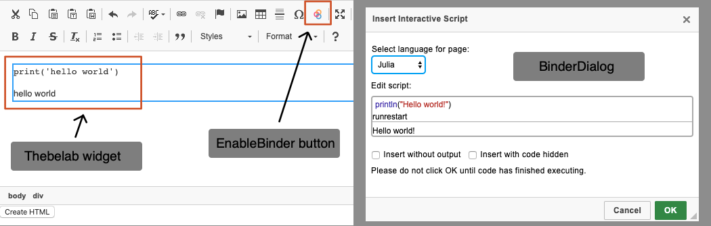
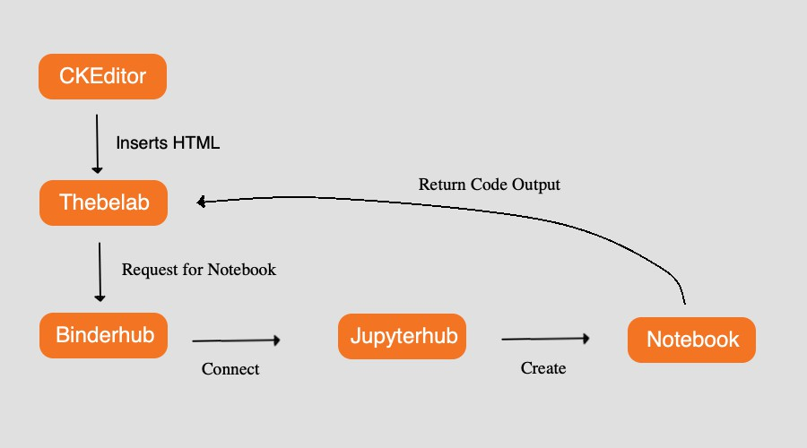

# Ckeditor-binder-plugin Developer Guide

> This document is intended for developers who wish to contribute to ckeditor-binder-plugin. Prior knowledge in HTML and Javascript is required to understand this document.

## Introduction

Ckeditor-binder-plugin is a [CKEditor](https://ckeditor.com/) plugin that allows users to insert executable code blocks from the editor. It is developed by the [LibreTexts organization](https://libretexts.org/) [jupyter team](https://jupyter.libretexts.org/hub/static/external/pages/about.html) for textbook authors to create free interactive textbooks. These textbooks contain executable code blocks for students to modify and run code examples while reading. Ckeditor-binder-plugin aims to remove the technical barrier of inserting executable code blocks to make the process as easy as possible.

## Plugin UI Components

When the plugin is registered, three UI components will be available in CKEditor: __enableBinder button__, __binderDialog__, and __thebelab widget__.



__EnableBinder button__: The button displayed on the toolbar that opens __binderDialog__ when a user clicks it. It is registered via `editor.ui.addButton`.

__BinderDialog__: The dialog window that allows users to edit, run, and configure the code block they wish to insert. It is registered using `editor.dialog.add`.

__Thebelab widget__: The UI component that will be inserted to the editor. It contains the inserted code and its output. This is registered using `editor.widgets.add`.

## How does it work?

This section introduces the five components this plugin uses and how they interact with each other. The five components are: __CKEditor__, __Thebelab__, __BinderHub__, __JupyterHub__, and __Jupyter notebook__.



* __CKEditor__: An HTML editor that dominates the web world. Basically every online editor you've used is a distribution of it.
* __Thebelab__: A JavaScript code that transforms specific HTML structures into executable code blocks.
* __BinderHub__: A web server that allows users to build Jupyter Notebooks from a public repository.
* __JupyterHub__: A web server that allows users to run Jupyter Notebooks on the web.
* __Jupyter Notebook__: A web user interface where users can execute code snippets and receive immediate results.

### Stage 1: The Plugin Inserts HTML for Thebelab

As a plugin of CKEditor, we can insert any kind of HTML into the editor using the provided API from CKEditor. The strategy is to let users input the code on the dialog, and we will insert the following HTML to the editor:

```html
<pre data-executable="true">
  <!-- the user's code here... -->
</pre>
<div data-output="true">
  <!-- the output here... -->
</div>
```

The HTML structure above is defined by Thebelab. When we want to display the HTML to the readers, we will include thebelab's JavaScript code. Thebelab will then parse every HTML tag with a `data-executable` attribute into an interactive code block. Any following tag that has the attribute `data-output` will be set as the default output of the code block.

### Stage 2: Thebelab Connects with BinderHub

After the code blocks are initiated, Thebelab will connect to a BinderHub instance and provide binderHub two important information:

* __Repository URL__: A URL of a public repository that contains configurations on how to set up the environment for a Jupyter Notebook.
* __Kernel Option__: The programming language the code blocks are written in.

> In the Jupyter community, kernels are refered as the program that inteprets a programming language. See [jupyter wiki page](https://github.com/jupyter/jupyter/wiki/Jupyter-kernels) for available kernel options.

### Stage 3: BinderHub Connects with JupyterHub to Build a Jupyter Notebook

After BinderHub receives the information, it will try to build a [Docker](https://www.docker.com/) image with the configurations on the repository using the tool [repo2docker](https://github.com/jupyter/repo2docker). The images will be cached so that BinderHub doesn't have to rebuild them every time.

After the image is built, BinderHub will connect to JupyterHub to start a Jupyter Notebook server using the image. When the notebook is created, Thebelab will be told where to access the notebook. With this information, Thebelab can now send code snippets to the notebook and receive their output for display.

> For more information on how BinderHub works, check out _[The BinderHub Architecture](https://github.com/jupyterhub/binderhub/blob/master/doc/overview.rst)_.

## Development Environment

This section introduces three tools that are used to set up the development environment:

__Yarn__: A package management tool for Node.js and JavaScript. It helps to manage all the packages we use as well as maintaining the correct versions of them. Yarn creates a `yarn.lock` file that holds the information of the packages and their version. This will allow anyone who has this file to run `yarn install` to get the same development environment.

__Webpack__: Defined as a static module bundler for modern JavaScript applications on their [official website](https://webpack.js.org/concepts/). We use Webpack to combine and compress multiple JavaScript source files into a single file. This reduces load time because it will only take a single request to get the code. The commands for Webpack has been simplified using Yarn. The development build is set to `yarn start`, and the production build is set to `yarn build`.

__ESLint__: A JavaScript linter that reports invalid code styles using a set of rules set by the user. In this project, we use Airbnb's open-source [ESlint configuration](https://github.com/airbnb/javascript/tree/master/packages/eslint-config-airbnb-base). It is setup in Webpack so that Webpack will report styling errors in the development environment.

> See Airbnb's [JavaScript repository](https://github.com/airbnb/javascript) for the reason for each rule.

# Reference

* [CKEditor Official Website](https://ckeditor.com/)
* [CKEditor's Plugin Tutorial](https://ckeditor.com/docs/ckeditor4/latest/guide/plugin_sdk_sample_1.html)
* [CKEditor's Widget Tutorial](https://ckeditor.com/docs/ckeditor4/latest/guide/widget_sdk_tutorial_1.html)
* [Thebelab Documentation](https://thebelab.readthedocs.io/en/latest/)
* [BinderHub Documentation](https://binderhub.readthedocs.io/en/latest/)
* [JupyterHub Documentation](https://jupyterhub.readthedocs.io/en/stable/)
* [Jupyter Notebook Official Website](https://jupyter.org/)
* [Yarn Officail Website](https://yarnpkg.com/)
* [Webpack Officail Website](https://webpack.js.org/)
* [ESLint Officail Website](https://eslint.org/)

